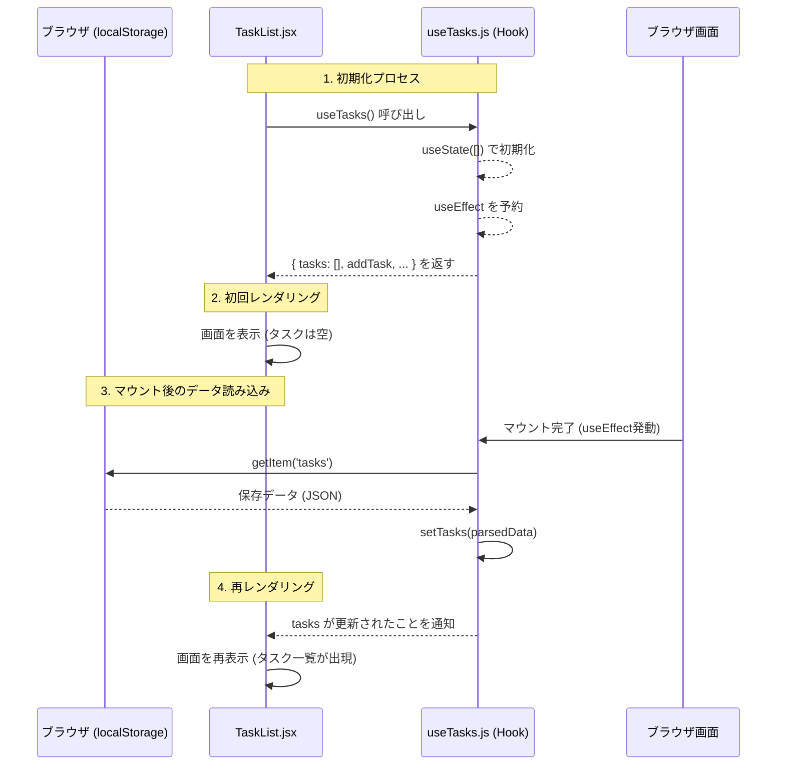

# ToDoアプリ解説：TaskListとuseTasksの連携について

## 1. `tasks` の読み込みとタイミング
`TaskList.jsx` で `useTasks()` を呼び出してから、実際にデータが表示されるまでの流れについての解説です。

### 実行の 5 ステップ

1.  **【準備】 `import` の時**
    *   `src/components/TaskList.jsx` の冒頭で `useTasks` をインポートした時点で、ブラウザはその関数を使う準備をします。

2.  **【実行】 `useTasks()` を呼び出した時**
    *   `TaskList` 関数の中で `const { tasks, ... } = useTasks()` が実行されます。
    *   この時、`useTasks.js` の中身（`useState` や `useEffect` の定義）が上から順に読み込まれます。

3.  **【描画】 ボタンや一覧が表示される時**
    *   React が `TaskList` の見た目（HTML）を作ります。この時点では、`tasks` はまだ空の配列 `[]` です。

4.  **【発動】 `useEffect` の実行**
    *   画面が表示された**直後**に、`useTasks` 内に登録された `useEffect` が動き出します。
    *   ここで `localStorage.getItem('tasks')` が走り、保存されているデータが取り出されます。

5.  **【更新】 `setTasks` による再描画**
    *   取り出したデータが `setTasks` に渡されると、React は「データが変わった！」と検知します。
    *   自動的に `TaskList` がもう一度描画し直され、画面にタスクが並びます。

---

## 2. まとめ：コードとライフサイクルの関係

| ステップ | 場所 | 処理の内容 |
| :--- | :--- | :--- |
| **Call** | `TaskList.jsx` | `useTasks()` を呼び出して中身を起動する |
| **Setup** | `useTasks.js` | `useState` 等を初期化し、`useEffect` を予約する |
| **Mount** | ブラウザ画面 | コンポーネントが一旦画面に表示される |
| **Load** | `useEffect` | 保存データを読み込み、`setTasks` で状態を更新する |
| **Re-render**| `TaskList.jsx` | 最新のタスク一覧で画面が書き換わる |

---

## 3. シーケンス図による可視化

`TaskList` が表示されてからデータが読み込まれるまでの流れを視覚化したものです。

